# heroku-postgres-modeanalytics
setup instructions for an mode analytics workspace connected to an heroku postgres database

# 
At first create an account at https://www.heroku.com/ and https://modeanalytics.com/. After that follow these steps:

# 1 setup an heroku app with postgresql
## 1.1 create an app
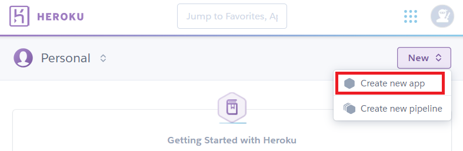
## 1.2 set app name and region and create
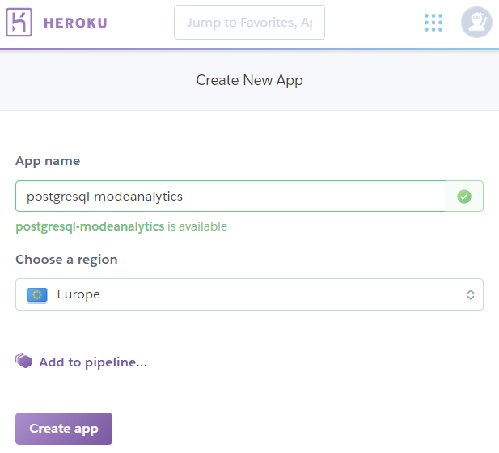
## 1.3 navigate to configure add ons
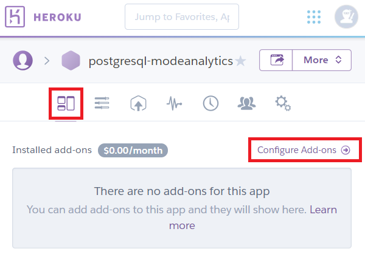
## 1.4 find more add ons
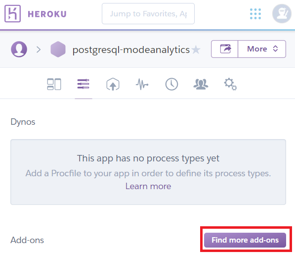
## 1.5 select heroku Postgres
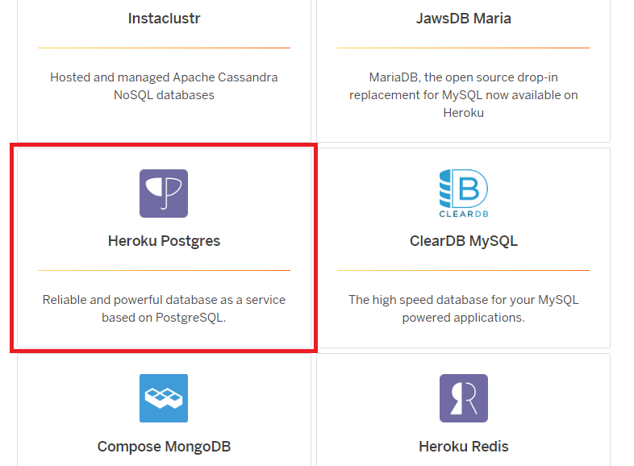
## 1.6 see plans & pricing and install add on
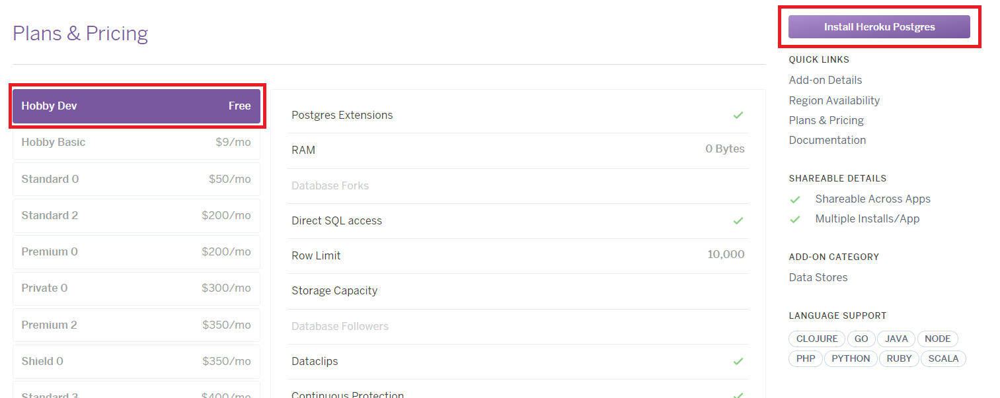
## 1.7 select your app
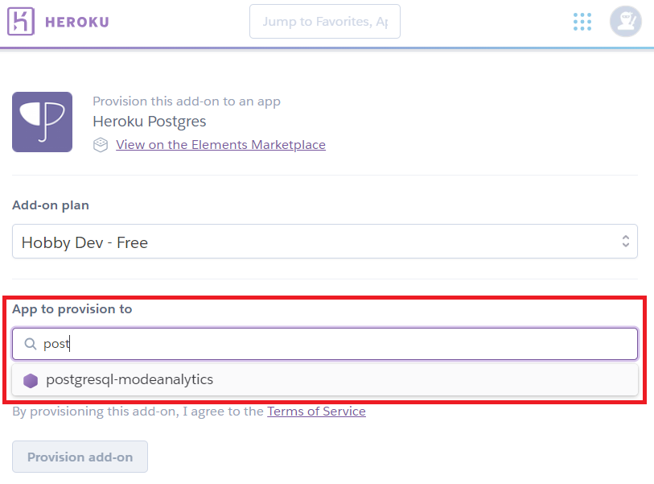
## 1.8 provision add on
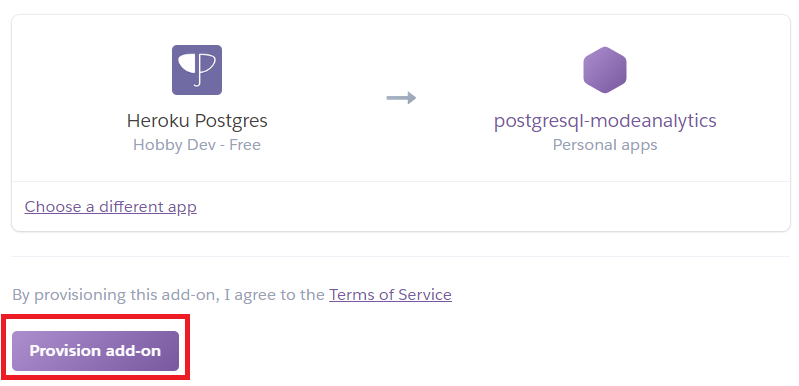
## 1.9 select the add on
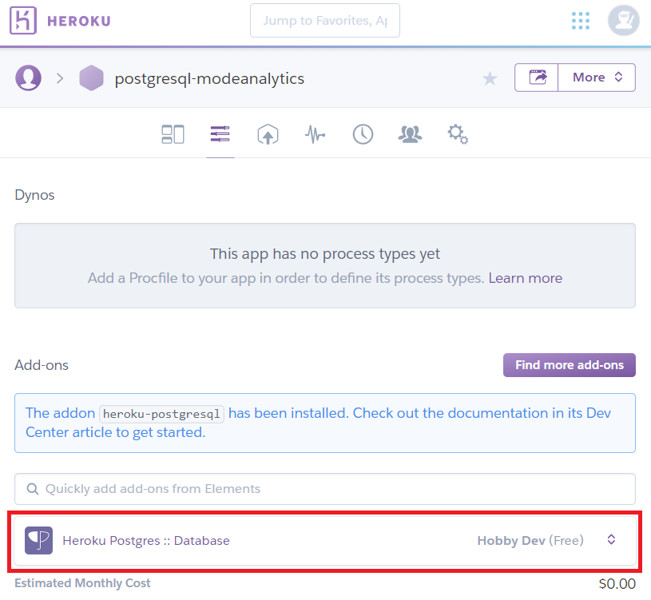
## 1.10 navigate to settings and view credentials
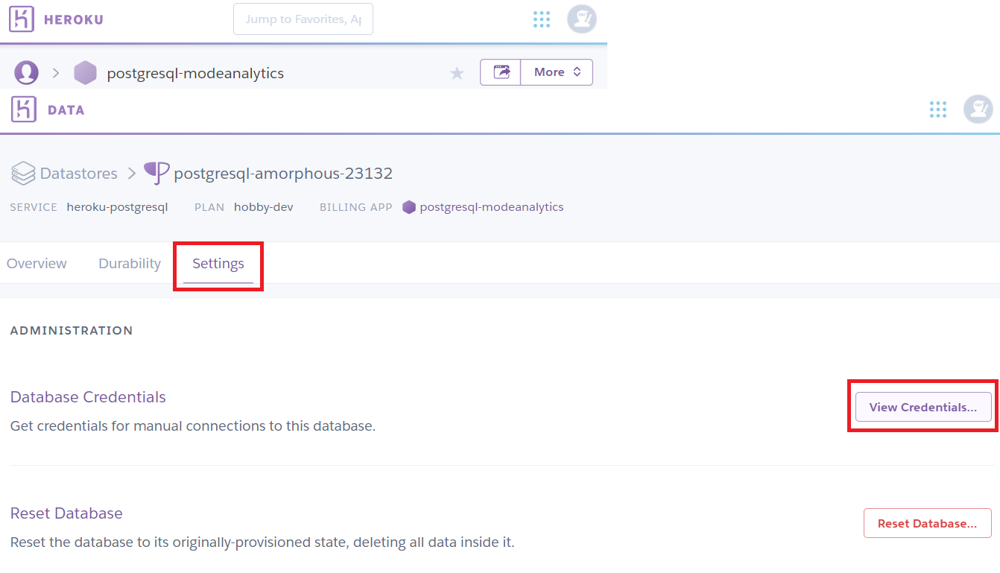
# 2 set up an workspace on mode analytics
## 2.1 connect to a database
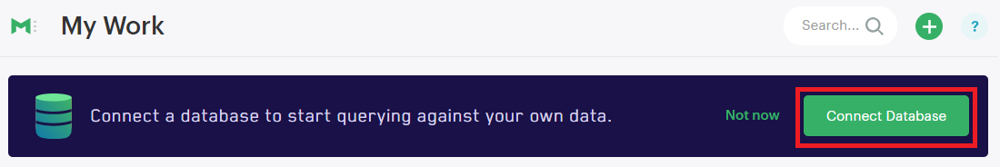
## 2.2 create an workspace
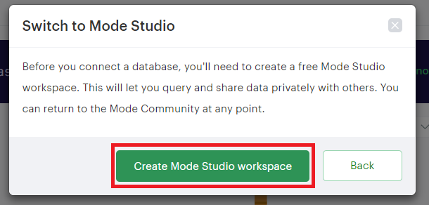
## 2.3 enter name an create
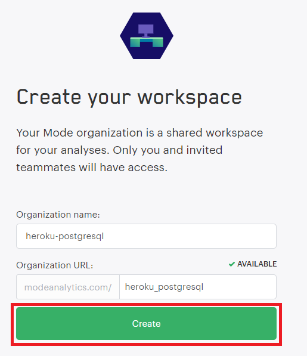
## 2.4 select PostgreSQL

# 3 connect database
## 3.1 match the fields as shown in the screen shot
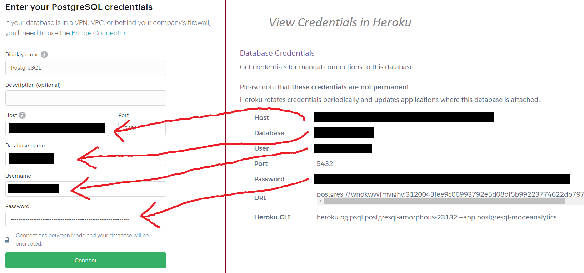
## 3.2 that's it :)
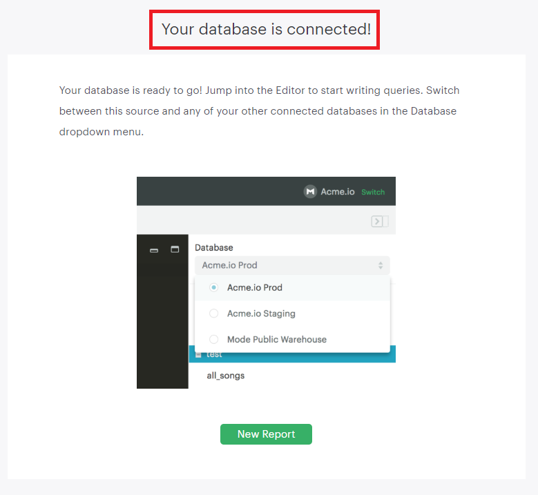
